# 프로젝트 - 중계나라🥕
- 중고거래 사이트를 벤치마크 하여 구매자와 판매자를 연결하여 중계해주는 중고거래 챗봇을 만들었습니다.
---
## 🔍 개발 스팩
- 프론트엔드: 카카오 챗봇 (Json 통신)
- 백엔드:
  - 언어: Java 11
  - 프레임워크: Spring boot 2.7
  - 데이터베이스: Mysql 8.0
  - ORM: JPA (Hibernate)
  - 주요 라이브러리: Redis, JWT, Jsoup
  - 테스트 라이브러리: Junit, MockMvc 
  - AWS: Ec2, S3, Route 53
  - CI/CD: GitHub Action, Docker
---
## 📮 아키텍처 설계
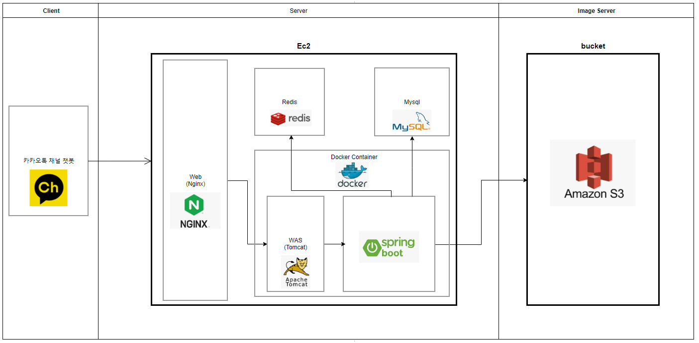

---
## 🚀 도메인 ERD 설계
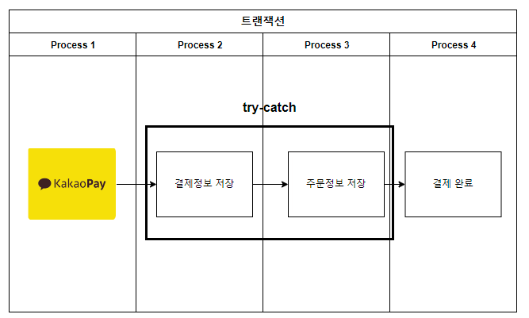

---
## 🎯 비즈니스 프로세서  
## 1. 첫번째 거래방법
  - **`구매할 상품을 찾는다.`**
    
    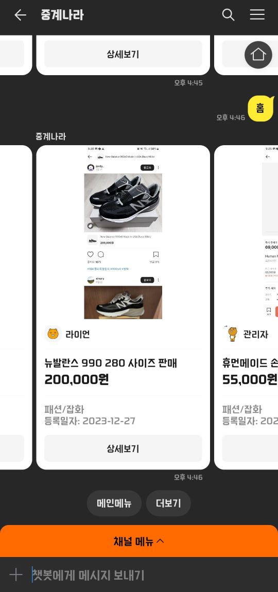
  - **`구매할 상품정보 및 상품사진을 확인하여 상품상태를 확인한다.`**
    
    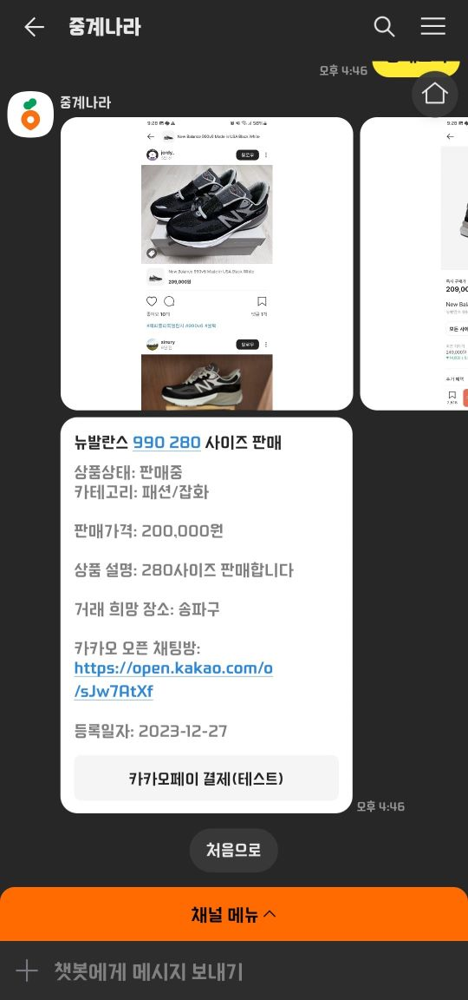
  - **`오픈채팅방에 입장해서 판매자와 대화하여 약속시간과 장소를 정한다.`**
    
    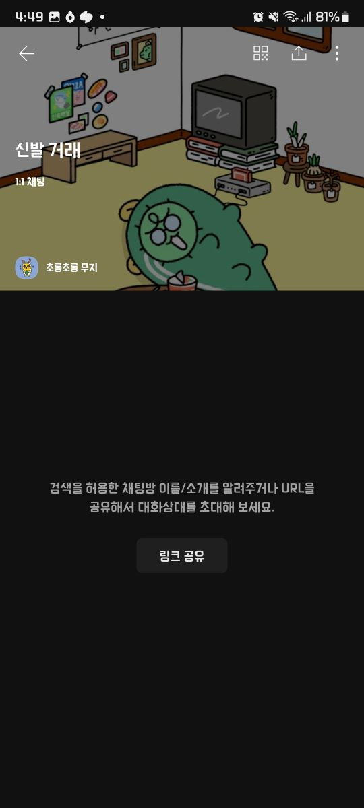
  - **`판매자는 약속시간까지 판매상품을 예약상태로 변경한다.`**
    
    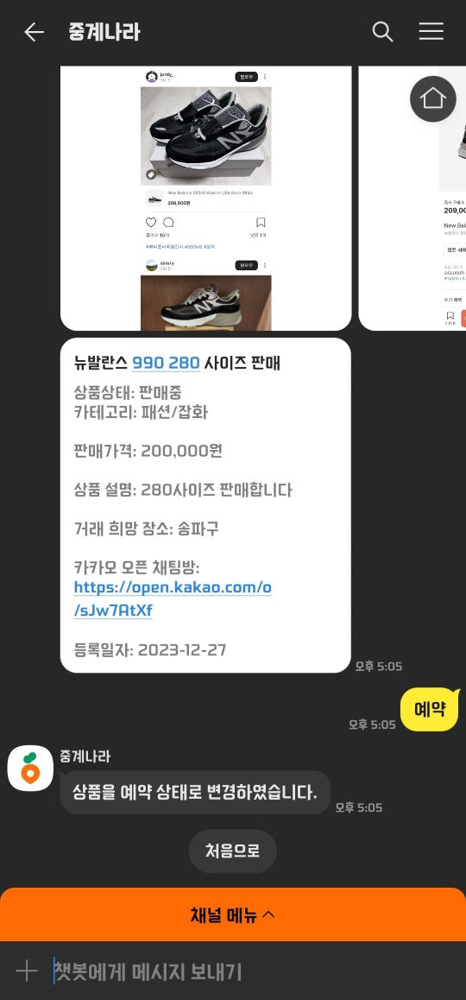
    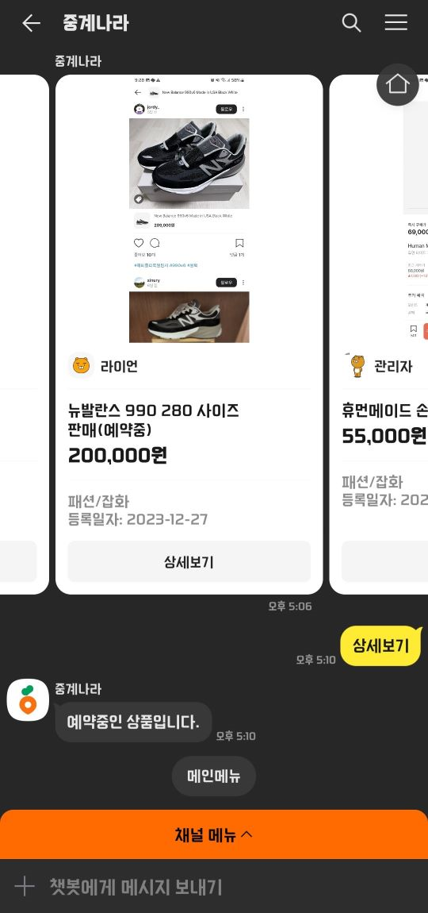
  - **`약속시간에 장소에 가서 판매자와 구매자가 직접 거래를 한다.`**
  - **`거래가 완료된 후 판매자는 예약상품을 판매완료 상태로 변경한다.`**
    
    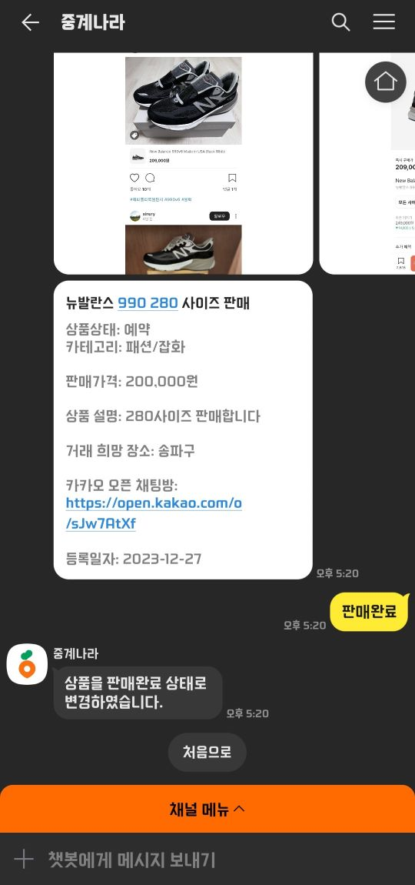
## 2. 두번째 거래방법
  - **`구매할 상품을 찾는다.`**
    
     
  - **`구매할 상품정보 및 상품 이미지를 확인한다.`**
    
     
  - **`카카오페이 결제를 한다.`**
    
     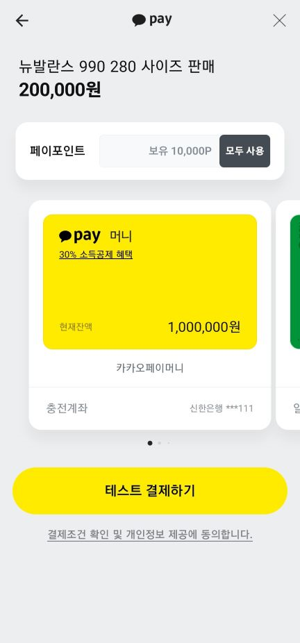
     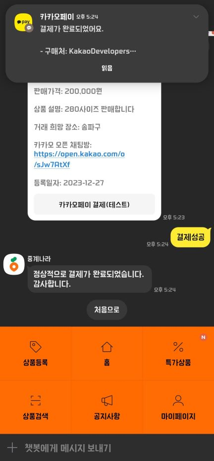
     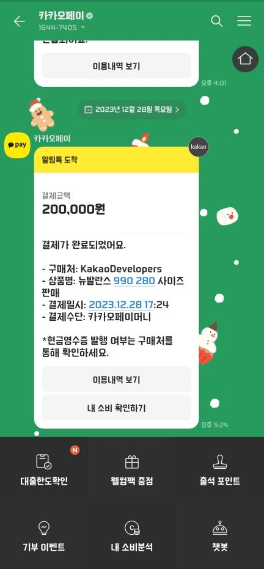
  - **`판매자는 운송장번호를 필수로 입력해야 구매확정 버튼이 활성화 되어 구매자가 구매확정을 할 수 있다.`**
  - **`운송장번호가 입력되고 상품을 정상적으로 받은 후 구매확정을 한다 구매확정이 되면 판매확정 버튼이 활성화 된다. `**
  - **`구매확정이 되면 판매자는 최종적으로 판매확정을 하여 거래완료가 되고 상품은 판매완료 상태로 된다.`**
    
     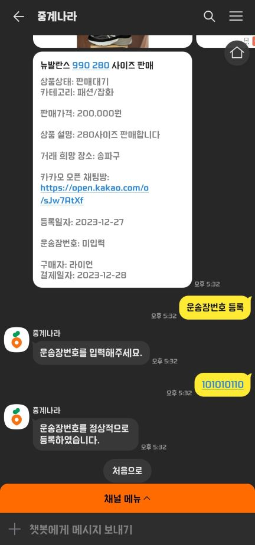
     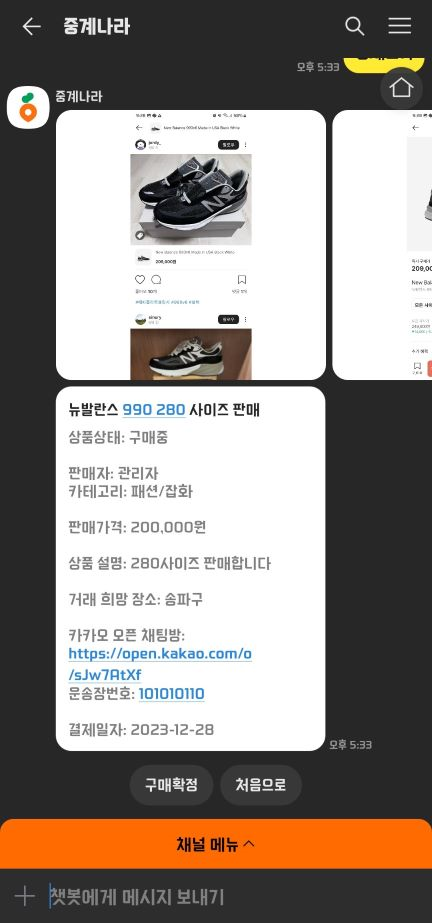
     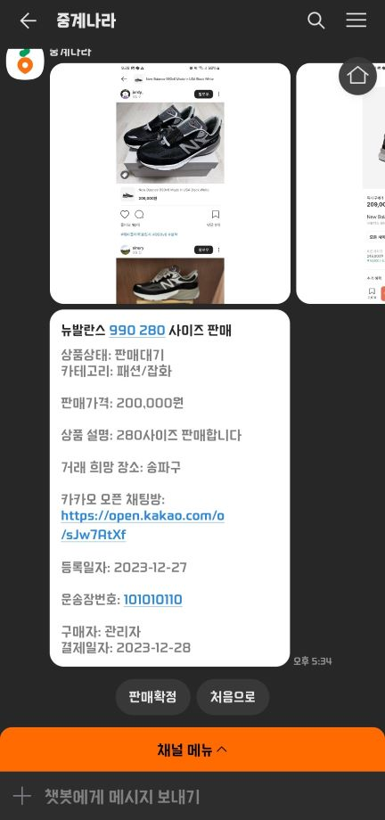

