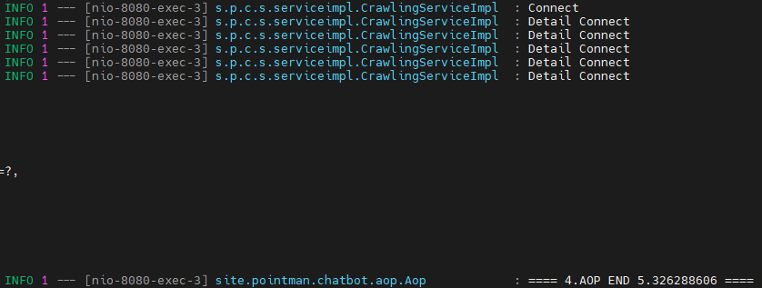

# 프로젝트 - 중계나라🥕
- 중고거래 사이트를 벤치마크 하여 구매자와 판매자를 연결하여 중계해주는 중고거래 챗봇을 만들었습니다.
---
## 🔍 개발 스팩
- GitHub: https://github.com/HSBODo/chatbot
- 도메인: https://www.pointman.shop
- 카카오 채널: https://pf.kakao.com/_eeEjG
- 프론트엔드: **`카카오 챗봇 (JSON 통신)`**
- 백엔드:
  - 언어: **`Java 11`**
  - 프레임워크: **`Spring boot 2.7`**
  - 데이터베이스: **`Mysql 8.0`**
  - ORM: **`JPA Hibernate`**
  - WEB: **`Nginx`**
  - WAS: **`Tomcat`**
  - 주요 라이브러리: **`Redis`** **`JWT`** **`AOP`** **`Jsoup`**
  - 테스트 라이브러리: **`Junit`** **`MockMvc`**
  - AWS: **`Ec2`** **`RDS`** **`Amazon S3`** **`Route 53`**
  - CI/CD: **`GitHub Action`** **`Docker`**
  

---
## 📮 아키텍처 설계

---
## 🎯 CI/CD 파이프라인

---
## 🚀 도메인 ERD 설계

---

## 🚨 라이브러리 사용 이유 및 트러블 슈팅 과정
### 1. Redis와 Jsoup 사용 이유 및 트러블 슈팅
* **`특가상품 기능`** 을 개발하기 위해 **`Jsoup`** 라이브러리를 활용하여 내가 자주 이용하는 특가정보 공유 사이트를 타겟하여 실제 데이터를 크롤링 하기로 했다. 
* 1페이지에 5개의 상품 데이터를 보여주기 위한 타겟 사이트의 총 Request 6회다.  

  
* **`타겟 사이트에서 한번에 빠르게 반복적인 Request 요청을 막는 이슈가 발생하였다.`**

* **`이슈를 해결하기 위해서 Thread.sleep(230)으로 요청 간격을 주어 해결하였다.`**
* 이슈는 해결하였지만 최종적으로 클라이언트에 응답하는 시간이 4~5초가 정도의 느린 응답속도였고, 카카오톡 챗봇의 타임아웃 5초 정책에 걸렸다.

* **`Request 요청 횟수를 줄이고 응답속도를 개선하기 위해 Redis를 사용하기로 하였다`**
* **`Redis를 활용하여 첫번째 조회 데이터를 메모리에 저장하고 똑같은 요청이 있으면 메모리에서 데이터를 가져와 응답 해주는 방식으로 이슈를 해결하였다.`**
* 그 결과 Request 횟수를 **`6회 -> 1회`** 로 줄였고, 최종 응답시간을 **`5초 -> 0.35초`** 로 개선하였다.  

### 2. AOP와 JWT 사용 이유
* 관리자 기능을 개발하였지만 아무나 사용해서는 안된다.
* 관리자임을 인증받고 관리자 기능을 사용해야 한다.
* 인증방식은 쿠키방식, 토큰방식, 세션방식이 있다.
* 쿠키 방식은 보안에 취약하고, 쿠키에는 용량 제한이 있어 많은 정보를 담을수 없다.
* 세션 방식은 서버의 세션 저장소를 사용하므로 요청이 많아지면 서버에 부하가 심해진다.
* **`JWT 토큰 방식을 선택한 이유는 Header와 Payload를 가지고 Signature를 생성하여 데이터 위변조를 막을 수 있고, Ec2 프리티어 서버 특성상 서버의 부하를 줄이기 위해 클라이언트 정보를 서버가 관리하지 않아 부하를 줄일 수 있어 선택하였다.`**
* JWT 토큰을 검증하기 위해 각각의 서비스마다 검증 코드를 넣는 것은 코드의 양도 늘어나고 시간도 오래걸려 비효울 적이다.
* 만약 검증 로직이 바뀌게 된다면 무지막지한 코드 수정이 일어날 것이다.
* AOP를 활용하여 관심사를 중복코드를 제거하고 시간을 절약 할 수 있다
* 2가지로 관심사로 분리하였다.
* **`첫번째 관심사는 챗봇 요청,응답 로그를 저장하고 응답속도를 확인하였다.`**
* **`두번째 관심사는 관리자 기능 메서드 호출 시 JWT 토근 검증을 담당하도록 하였다.`**

### 3. Ec2 프리티어 메모리 부족 이슈
* 많은 비용을 지불 할 여건이 되지 않아 서버를 Ec2 프리티어로 사용하기로 결정하였다.
* 그러다보니 Ec2 서버에는 Mysql,Redis,Docker,Spring boot 등 많은 프로세스가 실행하게 설계가 되었다.
* 많은 프로세스가 실행되다보니 Ec2 서버의 **`메모리 점유률이 92%`** 가 되었고, 더 이상 부하가 생기면 서버가 다운 되는 이슈가 발생하였다.
* 서버의 부하와 디스크 용량을 줄이기 위해 이미지 저장은 **`S3 버킷`** 에 하기로 결정하였다. 
* 하지만 효과는 별로 없었고, 서버는 금방이라도 다운 될 것만 같았다.
* 이슈를 해결하기 위해 **`Swap Memory`** 를 사용하기로 결정하였다.
* **`Swap Memory`** 는 하드디스크를 가상메모리로 활용하기 때문에 메모리보다 속도가 현저히 느리다.
* 2GB 하드디시크의 용량을 가상메모리로 할당하여 **`점유률이 92% -> 70%`** 로 임시적으로 이슈를 해결하였다.  

* **`Swap Memory`** 임시 조치를 해결하기 위해 DB 서버를 **`RDS`** 로 분리하여 관리하도록 아키텍처를 구성하였다.
* 그 결과 Application 서버 Ec2의 메모리 사용률과 CPU 사용률의 안정화를 찾고, 서버의 속도 개선을 하였다.

---
## 🚀 관리자 API 명세서

- **`POSTMAN:`**  **https://documenter.getpostman.com/view/22940487/2s9YkuZy7W#1ebc0f0c-9ebc-495c-b852-c4e939130267**

## 🎯 비즈니스 프로세스  
## 1. 첫번째 거래방법
  - **`구매할 상품을 찾는다.`**
    
    
    

  - **`구매할 상품정보 및 상품사진을 확인하여 상품상태를 확인한다.`**
    
    
    

  - **`오픈채팅방에 입장해서 판매자와 대화하여 약속시간과 장소를 정한다.`**
    
    
    

  - **`판매자는 약속시간까지 판매상품을 예약상태로 변경한다.`**
    
    
    
    

  - **`약속시간에 장소에 가서 판매자와 구매자가 직접 거래를 한다.`**
  - **`거래가 완료된 후 판매자는 예약상품을 판매완료 상태로 변경한다.`**
    
    
## 2. 두번째 거래방법
  - **`구매할 상품을 찾는다.`**
    
     
    

  - **`구매할 상품정보 및 상품 이미지를 확인한다.`**
    
     
    

  - **`카카오페이 결제를 한다.`**
    
     
     
     

  - **`판매자는 운송장번호를 필수로 입력해야 구매확정 버튼이 활성화 되어 구매자가 구매확정을 할 수 있다.`**
  - **`운송장번호가 입력되고 상품을 정상적으로 받은 후 구매확정을 한다 구매확정이 되면 판매확정 버튼이 활성화 된다. `**
  - **`구매확정이 되면 판매자는 최종적으로 판매확정을 하여 거래완료가 되고 상품은 판매완료 상태로 된다.`**
    
     
     
     

